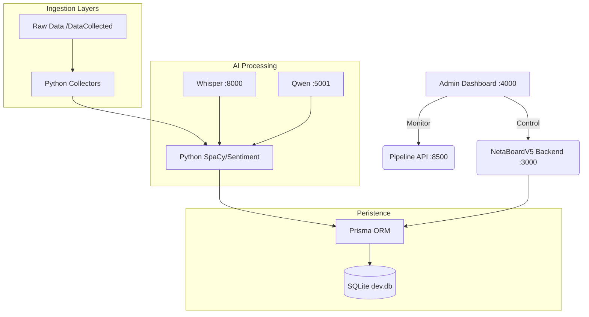

# 🗳️ NRI Political Intelligence Pipeline
### Full System Plan: From Raw TXT Files → NRI Scores → Feedback Overlay → Active Alerts

---



---

## 🏗️ Technical Realignment

The system has been consolidated from the original plan to use a more efficient **Local-First Architecture**:

1.  **Storage**: Moved from Milvus/Elasticsearch to **SQLite via Prisma**.
2.  **Orchestration**: Centered on the **Admin Dashboard** for live monitoring.
3.  **Intelligence**: Multi-modal extraction using **Whisper** (Audio), **Qwen** (Vision), and **SpaCy** (NLP).


---

## 📁 STAGE 1 — Preprocessing (Before DB Load)

### Step 1.1 — Folder-to-Source Mapping

Each folder maps to a data source type. Tag every chunk with metadata before storing.

```python
SOURCE_MAP = {
    "facebook":            {"type": "social",      "platform": "facebook",   "weight": 1.0},
    "twitter":             {"type": "social",       "platform": "twitter",    "weight": 1.2},
    "youtube_transcript":  {"type": "video",        "platform": "youtube",    "weight": 0.9},
    "Scraped_Simulations": {"type": "web",          "platform": "news",       "weight": 1.3},
    "PDF_Documents":       {"type": "official",     "platform": "document",   "weight": 1.5},
    "database":            {"type": "structured",   "platform": "db",         "weight": 1.4},
    "images_jpeg":         {"type": "visual",       "platform": "image",      "weight": 0.7},
    "PDF_URL_Scrape_Batch":{"type": "web",          "platform": "scraped_pdf","weight": 1.2},
}
```

### Step 1.2 — Chunking Logic

Split each `.txt` file into overlapping ~300 token chunks with source metadata attached.

```python
def preprocess_txt(filepath, source_folder):
    with open(filepath) as f:
        raw = f.read()

    chunks = chunk_text(raw, size=300, overlap=50)

    tagged = []
    for chunk in chunks:
        tagged.append({
            "text":      chunk,
            "source":    source_folder,
            "timestamp": extract_timestamp_from_filename(filepath),
            "entity":    None,   # filled by entity extraction
            "pillar":    None,   # filled by LLM scoring
        })
    return tagged
```

### Step 1.3 — Entity Extraction Prompt

Run this on every chunk **before** inserting into the DB.

```
SYSTEM:
You are a political intelligence parser for Indian elections.
Extract the primary political entity this text is about.
Return JSON only. No explanation.

USER:
TEXT: "{chunk}"

Return:
{
  "entity":       "<politician name, party name, or null>",
  "entity_type":  "politician | party | organization | null",
  "constituency": "<if mentioned, else null>",
  "state":        "<if mentioned, else null>"
}
```

---

## 🧠 STAGE 2 — LLM Pillar Scoring

Run once per entity after collecting all tagged chunks for that entity.

### NRI Pillars Reference

| # | Pillar | Weight | Notes |
|---|--------|--------|-------|
| 1 | 🗳️ Electoral Strength | 15% | |
| 2 | 🏛️ Legislative Performance | 12% | |
| 3 | 🏗️ Constituency Development | 12% | |
| 4 | 🤝 Public Accessibility | 8% | |
| 5 | 🎤 Communication | 7% | |
| 6 | ⭐ Party Standing | 7% | |
| 7 | 📺 Media Coverage | 6% | |
| 8 | 📱 Digital Influence | 6% | |
| 9 | 💰 Financial Muscle | 5% | |
| 10 | 🔗 Alliance Intel | 5% | |
| 11 | ⚖️ Caste Equation | 5% | |
| 12 | 📉 Anti-Incumbency | 4% | **INVERTED** |
| 13 | 🌱 Grassroots Network | 4% | |
| 14 | 🧭 Ideology Consistency | 2% | |
| 15 | ⚠️ Scandal Index | 2% | **INVERTED** |

### Step 2.1 — Pillar Scoring Prompt

```
SYSTEM:
You are an expert political analyst for Indian elections.
You will receive text chunks from social media, news, documents, and public data.
Score the sentiment/strength of each NRI pillar from this data.

PILLAR DEFINITIONS:
- Electoral Strength:       vote share, rally attendance, booth management
- Legislative Performance:  bills, parliament attendance, debates
- Constituency Development: roads, water, schools, welfare schemes
- Public Accessibility:     jan darbar, public meetings, grievance response
- Communication:            speeches, clarity, messaging quality
- Party Standing:           loyalty, internal rank, leadership trust
- Media Coverage:           positive vs negative coverage volume
- Digital Influence:        social media reach, engagement, virality
- Financial Muscle:         campaign funding signals, donor mentions
- Alliance Intel:           coalition partners, seat sharing signals
- Caste Equation:           caste coalition support signals
- Anti-Incumbency:          complaints, dissatisfaction (HIGH = more anti-incumbency)
- Grassroots Network:       booth workers, karyakartas, ground reports
- Ideology Consistency:     alignment with party manifesto and past positions
- Scandal Index:            corruption, legal cases, controversies (HIGH = more scandal)

CHUNKS:
{all_chunks_for_entity}

Return JSON ONLY:
{
  "entity": "<name>",
  "scores": {
    "electoral_strength":       {"score": 0-100, "confidence": 0.0-1.0, "evidence": "<1 line>"},
    "legislative_performance":  {"score": 0-100, "confidence": 0.0-1.0, "evidence": "<1 line>"},
    "constituency_development": {"score": 0-100, "confidence": 0.0-1.0, "evidence": "<1 line>"},
    "public_accessibility":     {"score": 0-100, "confidence": 0.0-1.0, "evidence": "<1 line>"},
    "communication":            {"score": 0-100, "confidence": 0.0-1.0, "evidence": "<1 line>"},
    "party_standing":           {"score": 0-100, "confidence": 0.0-1.0, "evidence": "<1 line>"},
    "media_coverage":           {"score": 0-100, "confidence": 0.0-1.0, "evidence": "<1 line>"},
    "digital_influence":        {"score": 0-100, "confidence": 0.0-1.0, "evidence": "<1 line>"},
    "financial_muscle":         {"score": 0-100, "confidence": 0.0-1.0, "evidence": "<1 line>"},
    "alliance_intel":           {"score": 0-100, "confidence": 0.0-1.0, "evidence": "<1 line>"},
    "caste_equation":           {"score": 0-100, "confidence": 0.0-1.0, "evidence": "<1 line>"},
    "anti_incumbency":          {"score": 0-100, "confidence": 0.0-1.0, "evidence": "<1 line>"},
    "grassroots_network":       {"score": 0-100, "confidence": 0.0-1.0, "evidence": "<1 line>"},
    "ideology_consistency":     {"score": 0-100, "confidence": 0.0-1.0, "evidence": "<1 line>"},
    "scandal_index":            {"score": 0-100, "confidence": 0.0-1.0, "evidence": "<1 line>"}
  },
  "data_quality": "high | medium | low",
  "chunk_count": <int>
}
```

### Step 2.2 — Weighted NRI Score Calculation (Pure Python, No LLM)

```python
WEIGHTS = {
    "electoral_strength":       0.15,
    "legislative_performance":  0.12,
    "constituency_development": 0.12,
    "public_accessibility":     0.08,
    "communication":            0.07,
    "party_standing":           0.07,
    "media_coverage":           0.06,
    "digital_influence":        0.06,
    "financial_muscle":         0.05,
    "alliance_intel":           0.05,
    "caste_equation":           0.05,
    "anti_incumbency":          0.04,  # INVERTED
    "grassroots_network":       0.04,
    "ideology_consistency":     0.02,
    "scandal_index":            0.02,  # INVERTED
}

INVERTED = {"anti_incumbency", "scandal_index"}

def compute_nri(scores: dict) -> float:
    total = 0
    for pillar, weight in WEIGHTS.items():
        s = scores[pillar]["score"]
        if pillar in INVERTED:
            s = 100 - s       # Invert: high raw score = bad outcome
        total += s * weight
    return round(total, 2)
```

---

## 📡 STAGE 3 — Feedback Overlay (People's Voice vs Official NRI)

The feedback score uses **public sources only** (social media, YouTube). The NRI score uses all sources. The gap reveals divergence.

### Feedback Source Filter

```python
FEEDBACK_SOURCES = {"facebook", "twitter", "youtube_transcript"}
```

### Feedback Sentiment Prompt (Per Pillar, Per Entity)

```
SYSTEM:
You are analyzing PUBLIC SENTIMENT ONLY from social media and public comments.
Score how the general PUBLIC feels about this politician's {PILLAR_NAME}.

SCALE: 0 = extremely negative | 50 = neutral/mixed | 100 = extremely positive
Return null if there is no relevant public data for this pillar.

PUBLIC CHUNKS:
{public_only_chunks}

Return JSON:
{
  "pillar":           "{pillar_name}",
  "feedback_score":   0-100,
  "dominant_emotion": "anger | support | indifference | hope | frustration",
  "top_complaints":   ["...", "..."],
  "top_praises":      ["...", "..."],
  "sample_size":      <number of chunks used>
}
```

### Gap Calculation & Interpretation

```python
def compute_gaps(nri_scores: dict, feedback_scores: dict) -> dict:
    gaps = {}
    for pillar in WEIGHTS.keys():
        nri  = nri_scores.get(pillar, 50)
        fb   = feedback_scores.get(pillar, 50)
        gap  = nri - fb
        gaps[pillar] = {
            "nri_score":      nri,
            "feedback_score": fb,
            "gap":            gap,
            "direction":      "over" if gap > 0 else "under",
            "alert":          abs(gap) > 20,
            "risk_type":      "voter_disillusionment" if gap > 20 else
                              "unrealised_opportunity" if gap < -20 else "aligned"
        }
    return gaps
```

| Gap | Meaning | Action |
|-----|---------|--------|
| `NRI > Feedback` by 20+ | Official data overestimates public sentiment | Risk: voter disillusionment |
| `Feedback > NRI` by 20+ | Public perceives more than data shows | Opportunity: amplify messaging |
| Gap < ±20 | Aligned | Monitor normally |

---

## ⚡ STAGE 4 — Alert Detection

Run on **most recent 72h chunks only** (filter by timestamp). Run every 6 hours via cron.

### Alert Detection Prompt

```
SYSTEM:
You are a political crisis detection system for Indian elections.
Analyze recent data chunks and detect actionable alerts.

ALERT TYPES TO DETECT:
- EC_NOTICE:         Election Commission notices, expenditure violations
- VIRAL_NEGATIVE:    Viral negative video/audio/social content
- ALLIANCE_STRESS:   Coalition partner tensions or seat demand threats
- DEEPFAKE:          Fake audio/video allegations
- COMPLAINT_SURGE:   Ward/constituency complaint spike (water, roads, etc.)
- NRI_DROP:          Score decline signals in coverage
- GROUND_SHIFT:      Booth-level positive or negative movement

SEVERITY LEVELS: CRISIS | HIGH | MEDIUM | LOW

CHUNKS (last 72 hours):
{recent_chunks}

Return a JSON array. Empty array [] if no alerts found.
[
  {
    "type":                 "EC_NOTICE | VIRAL_NEGATIVE | ...",
    "severity":             "CRISIS | HIGH | MEDIUM | LOW",
    "summary":              "<1 sentence description>",
    "recommended_action":   "<specific, actionable step>",
    "confidence":           0-100,
    "affected_pillar":      "<pillar name if applicable, else null>",
    "location":             "<ward/constituency if mentioned, else null>"
  }
]
```

---

### SQLite via Prisma — Unified Store

Indices used in `Prisma`:
*   `Archetype`: Core entity data (Politicians/Parties).
*   `PillarScore`: 15 NRI pillar results linked to Archetype.
*   `SocialItem`: Raw ingested chunks with sentiment and metadata.
*   `Alert`: Detected crises with severity and recommended actions.
*   `Feedback`: People's voice scores for Gap Analysis.

```json
// Example Ingested SocialItem
{
  "id": "uuid",
  "platform": "Twitter",
  "author": "@UserHandle",
  "text": "The local roads in Ward 5 are completely broken...",
  "sentiment": -0.85,
  "emotion": "anger",
  "likes": 42
}
```


---

## 🔄 STAGE 6 — Query & Analysis Flow (Post-DB)

```python
def analyze_entity(entity_name: str, time_window_days: int = 7):

    # 1. Semantic search Milvus for entity chunks
    chunks = milvus.search(
        query   = f"news opinions sentiment about {entity_name}",
        filter  = f"entity == '{entity_name}' AND timestamp > {days_ago(time_window_days)}",
        top_k   = 200
    )

    # 2. Score all 15 NRI pillars via LLM
    nri_scores = llm_score_pillars(chunks)

    # 3. Compute weighted NRI total
    nri_total = compute_nri(nri_scores)

    # 4. Score feedback overlay (public sources only)
    public_chunks    = [c for c in chunks if c["source"] in FEEDBACK_SOURCES]
    feedback_scores  = llm_score_feedback(public_chunks)

    # 5. Compute gaps
    gaps = compute_gaps(nri_scores, feedback_scores)

    # 6. Detect alerts from last 72h
    recent_chunks = [c for c in chunks if c["timestamp"] > hours_ago(72)]
    alerts        = llm_detect_alerts(recent_chunks)

    # 7. Store full result to Elasticsearch
    es.index("nri_scores", {
        "entity":          entity_name,
        "timestamp":       now_iso(),
        "nri_total":       nri_total,
        "pillar_scores":   nri_scores,
        "feedback_scores": feedback_scores,
        "gaps":            gaps,
        "alerts":          alerts,
    })

    return {
        "nri_total":       nri_total,
        "pillar_scores":   nri_scores,
        "feedback_scores": feedback_scores,
        "gaps":            gaps,
        "alerts":          alerts,
    }
```

---

## 🗂️ Execution Order & Schedule

| Step | Task | When | Tool |
|------|------|------|------|
| 1 | Preprocess all `.txt` → chunks | Before DB load | Python |
| 2 | Entity extraction per chunk | Before DB load | LLM prompt |
| 3 | Embed chunks → Milvus | DB load | Embedder + Milvus |
| 4 | Store raw chunks → Elasticsearch | DB load | ES client |
| 5 | LLM pillar scoring per entity | After DB, on-demand | LLM prompt |
| 6 | Feedback overlay scoring | After Step 5 | LLM prompt |
| 7 | Gap calculation + store | After Steps 5 + 6 | Python |
| 8 | Alert detection (72h window) | Every 6h via cron | LLM prompt |
| 9 | Dashboard query from ES | On-demand / live | Elasticsearch |

---

## ⚙️ Implemented Stack

| Component | Tool | Why |
|-----------|------|-----|
| **Core Admin** | Node.js + Express (Port 4000) | Service orchestration and Query Proxy. |
| **Main Dashboard** | React/Vite + Express (Port 5180/3000) | Visualizing results for end-users. |
| **Vision API** | Qwen-VL (Port 5001) | OCR and visual intelligence. |
| **Audio API** | Whisper (Port 8000) | Social media video transcription. |
| **Pipeline API** | FastAPI + SpaCy (Port 8500) | NLP, NER, and multi-stage processing. |
| **Database** | SQLite + Prisma | Easy local setup, high performance for relational data. |
| **Storage** | Local Filesystem (/DataCollected) | Permanent archive of all raw data. |

### Docker Quick Start

```bash
# Elasticsearch
docker run -d --name es \
  -e "discovery.type=single-node" \
  -p 9200:9200 \
  elasticsearch:8.12.0

# Milvus Standalone
docker run -d --name milvus \
  -p 19530:19530 \
  milvusdb/milvus:latest

# Ollama (for local LLM)
ollama pull llama3
ollama pull nomic-embed-text
```

---

## 🔑 Key Design Principles

1. **Alerts BEFORE DB** — Extract 72h alerts from raw files at preprocessing time. Don't wait for DB population.
2. **NRI score uses ALL sources** — Official data + social + news + documents.
3. **Feedback score uses PUBLIC only** — Facebook + Twitter + YouTube comments.
4. **Gap > ±20 triggers divergence alert** — Automated, no manual review needed.
5. **Inverted pillars** — Anti-Incumbency and Scandal Index: `effective_score = 100 - raw_score` before weighting.
6. **Confidence-weighted scoring** — Low-confidence pillar scores get flagged, not hidden.
7. **Timestamp-first chunking** — Every chunk carries the source file's timestamp for time-windowed queries.

---

*Generated for NRI Political Intelligence System · Pipeline Version 1.0*
